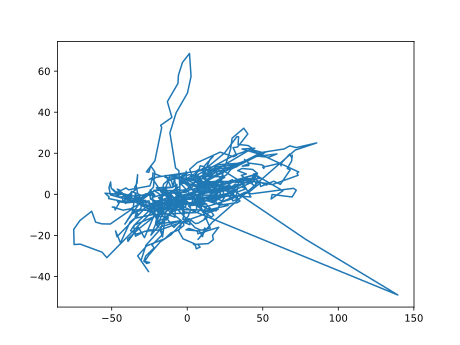
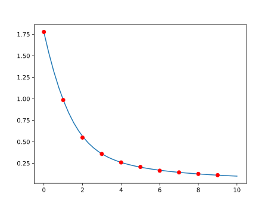

# Wandering thoughts

In the past couple of years I have been going on a variety of walks, guided by a route-map on my mobile phone. I pay a monthly subscription to access these features at , and aided by the cheaper fares that come with age. There is an app associated with Android (what I use) or for the posher Apple systems. Recently the app seems to have been upgraded to enable route creation on the phone - before I had to use my desktop through the web browser.

## The niggle

This is all great, but I have noticed over time is that the distance of the routes as-prepared was shorter than the GPS-derived distance plotted as I followed the route. Off the bat I came up with a number of explanations (while on said walks, in bed, in the bath, staring into space, etc.). The main possibilities/contributions:

### Fractal effects

Maps provide a smoothed-out version of reality. What seems a straight path can be quite twisty when you actually come to perambulate it. The situation is even worse from the ant-perspective, climbing or avoiding twigs and so on. Continuing as an [incredibile shrinking person](https://www.imdb.com/title/tt0050539/) we see cells, atoms, electrons, neutrons, protons, quarks, . . . And what is "reality" anyway? We could, on the other hand, expand our perspective: the solar system, galaxy, cluster, supercluster, filament.

This effect would tend to make the "actual" path longer, but I don't think it is the main ingredient.

### Accumulated GPS errors

As with all measurements, GPS plotting involves an approximation and therefore error. When using such measurements it is important to understand as best you can the [accuracy and precision](https://www.bbc.co.uk/bitesize/topics/zqkk7ty/articles/zccqqfr#zr3bbqt) of the measurements.

According ["Official U.S. government information about the Global Positioning System (GPS)"](https://www.gps.gov/systems/gps/performance/accuracy/): "GPS-enabled smartphones are typically accurate to within a 4.9 m (16 ft.) radius under open sky ([VIEW SOURCE AT ION.ORG](https://www.ion.org/publications/abstract.cfm?articleID=13079)). However, their accuracy worsens near buildings, bridges, and trees."

A simple test I carried out was to put my phone on a window-sill (reducing the accuracy, but I didn't want to leave it outside, away from buildings . . . , where someone would likely pick it up, and I don't have a garden). I tried two different windows pointing in different directions:

Direction | Distance | Duration | Moving Time | Avg. Speed | Total Ascent
--- | --: | --: | --: | --: | --: |
"East" | 4.97km | 01:52:47 | 01:52:47 | 2.65kph | 0.00m
"West" | 5.86km | 01:19:58 | 01:19:58| 4.40kph | 3.39m

#### An image of "West":

It's prettier on the app, but I don't want random people knowing exactly where I live! The scale is metres. The standard deviation is of the order of tens of metres ($\sigma_x=28m,\sigma_y=12m$), rather than 5m. I rendered the image and derived the statistics by downloading a "gpx" file, and performing some calculations.

There are 820 data points, so the normal probability to exceed $3\sigma$ is around 0.2%, or 1.65 events. In the $x$ direction there are about two such events. There are about three or four "large" deviations in $y$. We may suspect that the tails are somewhat chubby (but see below), although there is not enough data to make a true judgement. This could be due to variability in accuracy, e.g., the number of satellites overhead, weather, etc.

I have gone away and thought about why the "East&ndash;West" deviation is larger than the "North-South". Initially my guess was that it was an intrinsic thing, such as a difference between latitude and longitude, maybe how they are mapped onto $x$-$y$ coordinates. Or maybe later the positioning of the satellites. After a kip, it occurred to me that the problem was probably due to the window placement cutting off good signal access. Facing west one is cut off from good coverage in the east direction, possibly also explaining the large deviation event (and also the larger number of near 3$\sigma$ events on the right). This probably also deals, mostly, with the chubby tail problem.

#### East:

Above is the rendering for the "East" window experiment, performed after the above considerations of direction differences ("anisotropy", as it's called in the trade). This time the large deviations are westward. The standard deviations are: $\sigma_x=60m,\sigma_y=30m$. With these larger values the total diagram is within the 3$\sigma$ limits, but there seems to be confusion about where the centre is? Could this explain the larger $\sigma$ values? For reference, there are 867 data points. Although the experiment was longer (see table), the data points don't seem to have registered at a steady rate. They are more frequent for the "West" experiment. Why?

I tried the same test with a [GPS logging app](https://play.google.com/store/apps/details?id=eu.basicairdata.graziano.gpslogger). Although it initially showed movement, it quickly worked out the phone wasn't moving and reported that the speed was 0kph. This no doubt requires extra code, which the OS team or its subcontractors are not willing to include since they also have to cope with presenting other stuff like maps, saving activities, etc. The GPS logger only saves the data and presents simple thumbnail sketches of the route shape (even simpler than my x,y graph above). Apps are slowly developed and when a bell is added, a whistle often ceases to function correctly. The pointer on the OS app sometimes rotates to show the direction of travel, sometimes it doesn't. The "compass" section doesn't work at all for me - I guess I don't have the appropriate hardware on my cheapy device from China, which presumably reports [here](https://www.12339.gov.cn/).

_I think accumulated GPS error is the major source of the problem on the OS app._

### Other ideas

I also notice that there is some effect from GPS devices attempting to compensate for loss of signal/accuracy by extrapolating based on present movement. Partly some of such "compensations" are carried out in the GPS chip, rather than the software code. There also may be corrections needed from the model used to convert from latitude and longitude to flatish earth map coordinates.

## Plan of study

### In the satchel

Before writing this introduction (or the window experiments), I performed some calculations based on the normal "Gaussian" distribution. In particular, I carried out some Monte Carlo simulations of the window experiment, and for the reduction in error when one is plotting a steadily moving object. I also made predictions for the mean distance apparently travelled for both situations, giving the average error per GPS evaluation. For the moving object, this involves modified Bessel functions, in case that is a worry to you. Or you can take my word for it. This ends up in a plot of the excess distance ($y$-axis) for steps ($x$-axis) in units of $\sigma$, the equal standard deviation in the $x$ and $y$ directions:

The dots show the Monte Carlo results, and the line is the Bessel prediction.

Since we were just trying to understand the effect, we took no account of the different errors in different projections from latitude/longitude on the $x$- and $y$-axes. This would make the graph depend on the direction of motion.

### On the bench

Clearly the non-isotropy of the errors should be accommodated. Also, so far I have been looking at mean values where the correlations arising between the distances between two successive steps (due to a shared evaluation point) do not contribute. However, these effects are likely to affect standard deviations of paths.
